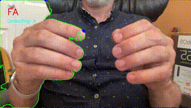
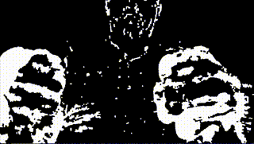

# AirType

3D spatial typing interface using computer vision hand tracking.

## Demo


*Type in mid-air using natural hand gestures - no keyboard required.*

## How It Works

### Current Prototype:
**Left Hand:**
- Index finger → T
- Middle finger → E  
- Ring finger → S

**Right Hand:**
- Thumb down → Space
- Index finger (top right) → Reset

### Full Vision:
Type by positioning your hands with palms facing each other, fingers naturally curved. Each finger controls a column of letters based on depth:

**Finger Positions:**
- **Raised finger** (extended up) → Top row
- **Forward poke** (toward camera) → Middle row  
- **Slight curl** (pulled back) → Bottom row

**Left Hand (Palm facing right):**
- Pinky: Q/A/Z
- Ring: W/S/X
- Middle: E/D/C
- Index: R/F/V + T/G/B (separate gesture)

**Right Hand (Palm facing left):**
- Index: Y/H/N (separate gesture) + U/J/M
- Middle: I/K/comma
- Ring: O/L/period
- Pinky: P/:/?

**Modifiers:**
- Thumb gestures: Space, Shift, Enter
- Two-hand gestures: Numbers, symbols

This creates a full QWERTY layout in 3D space without requiring any physical surface.

## Tech Stack

- **Computer Vision:** MediaPipe Hands
- **Processing:** OpenCV + Python
- **Detection:** Real-time finger position tracking

## Quick Start

```bash
python3.11 -m venv airtype_env
source airtype_env/bin/activate

pip install opencv-python mediapipe numpy
python airtype.py
```

## Applications

- VR text input without virtual keyboards
- Accessibility alternative for traditional typing
- Silent communication in shared spaces
- Proof of concept for spatial computing interfaces

## Early Development Approaches

<details>
<summary>Failed hand detection</summary>

1. **Skin Color Detection (Green Contours):**  
   Basic OpenCV approach using HSV color range detection. Drew green outlines around skin-colored regions but picked up faces, arms, and background objects.
   **Unreliable for precise gesture recognition.**

   

2. **Motion Detection (Black & White Mask):**  
   Background subtraction approach showing moving objects as white pixels on black background. Eliminated static skin-colored objects but detected any motion in frame, leading to false positives.
   **Unreliable for precise gesture recognition.**

   

    Both methods demonstrated the limitations of basic computer vision techniques before implementing MediaPipe's trained hand landmark detection models.
</details>

## Status

Working prototype. Currently supports basic character input with gesture recognition.

---

*Part of Timothy Mosby's computer vision portfolio*